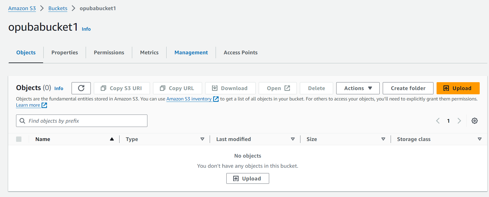

# Host-a-Website-on-Amazon-S3
## Detailed steps to hosting a static website on Amazon S3 (Simple Storage Service)
1. Login to AWS Console and go the S3 console
2. Create a new bucket and enter a globally unique bucket name.

