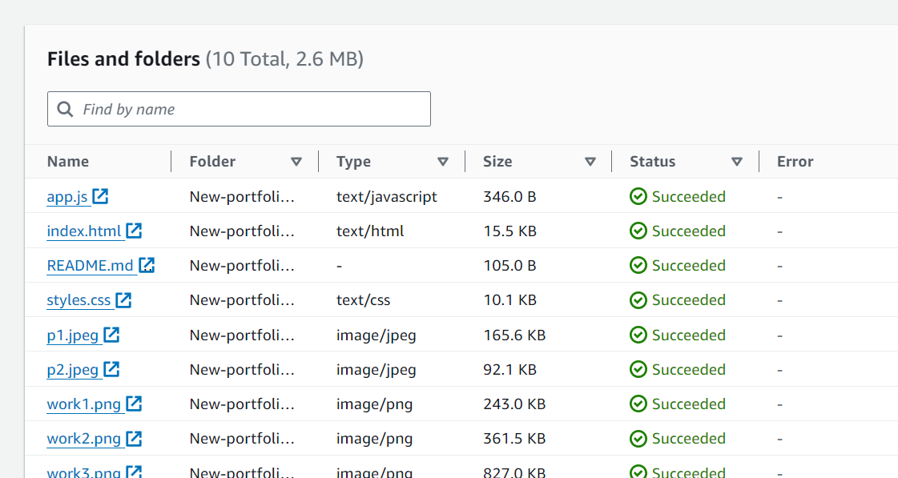
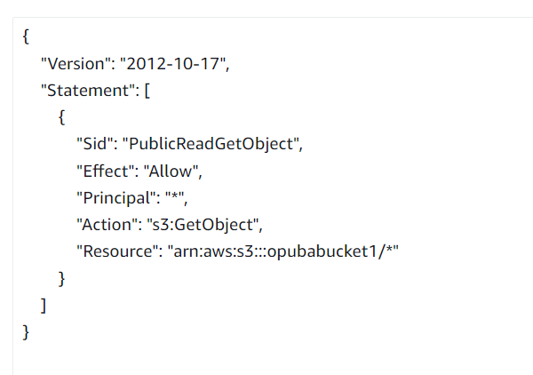

# Host-a-Website-on-Amazon-S3
## Detailed steps to hosting a static website on Amazon S3 (Simple Storage Service)
1. Login to AWS Console and go the S3 console
2. Create a new bucket and enter a globally unique bucket name.

3. Open the Bucket Settings and Configure Static Website Hosting
4. In the S3 console, open the newly created bucket and go to the Properties tab
5. Scroll down to Static Website Hosting and click Edit.
6. Select Enable under the static website hosting section.
7. Specify the index document (e.g., index.html).
8. Optionally, you can specify an error document (e.g., error.html) for handling errors such as 404.
9. Upload your files 

10. Add a bucket policy in JSON format provided by AWS and save 

